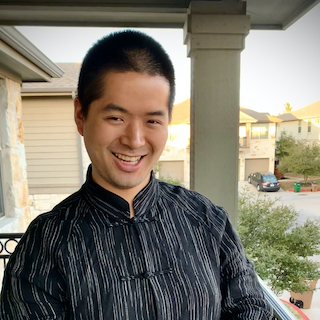
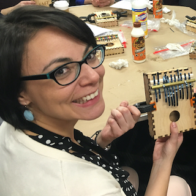

  

    <h1>About</h1>
  

### Mission Statement
_SMT-Pod_ is a creative venue for timely conversations about music, with episodes chosen through an open, collaborative peer review process. Audio-only podcasts offer a unique—though non-traditional—way of engaging with music, analysis, and contemporary issues in the field. This new publication medium affords our society both the ability to face outwards, by engaging in public scholarship, and inwards, by hosting meaningful conversations about the activity of music analysis. The variety of episode topics will reflect the diversity of the scholars and their scholarship in our field, making _SMT-Pod_ an invaluable publication for music analysts at any stage. Through its goal of promoting a sense of community and inclusivity, _SMT-Pod_ will reach beyond the boundaries of the SMT at this critical moment of calls for the revitalization of our field

>#### [Read more about our submission process](../submit)
>#### [Read more about our Open Collaborative Peer Review (OCPR)](../submit/OCPR)
>#### [Read about our ethics and standards for publication](ethics)

If you have any questions about the process, please feel free to contact the [_SMT-Pod_ Board](mailto:smt-pod@societymusictheory.org).

### Editorial Board

Contact us at [smt-pod@societymusictheory.org](mailto:smt-pod@societymusictheory.org).

#### Co-Editors

 

Jennifer Beavers (University of Texas, San Antonio) is a music theory professor who specializes in early twentieth-century analysis, sound-based analytical approaches, and music theory pedagogy. Some of her diverse research interests include timbre studies, the music of Maurice Ravel, 1920s jazz, pitch matching, and public music theory projects. She is committed to diversifying the academic pipeline by creating inclusive teaching practices, mentoring first-gen college students, and conducting various outreach and research projects with her Music Theory Club. She has published in Music Theory Online, Indiana Theory Review, Journal of Music Theory Pedagogy, Journal of Music Teacher Education, and has chapters in The Routledge Companion to Aural Skills Pedagogy, and The Oxford Handbook of Public Music Theory.

<strong>Favorite Podcasts:</strong> <a href="https://themoth.org/podcast" target="_blank">The Moth</a>, <a href="https://anothermotherrunner.com/category/another-mother-runner-podcast/" target="_blank">Another Mother Runner</a>, <a href="https://gimletmedia.com/shows/reply-all" target="_blank">Reply All</a>, <a href="https://switchedonpop.com" target="_blank">Switched on Pop</a>, <a href="https://www.npr.org/podcasts/510357/louder-than-a-riot" target="_blank">Louder than a Riot</a>.

 
Megan Lyons (Furman University) is an Assistant Professor of Music Theory. She received her PhD in music theory and history from the University of Connecticut. Her research areas include music theory pedagogy, music encoding and its analysis, Joni Mitchell’s alternate guitar tunings, and the art songs of Amy Beach. She is co-author with Dr. Philip Ewell of “Don’t You Cry for Me: A Critical-Race Analysis of Undergraduate Music Theory Instruction,” a chapter in the forthcoming edited volume Teaching and Learning Difficult Topics in the Music Classroom.

    

#### Program Committee & Team Leaders

 
Lydia Bangura (University of Michigan) is a singer and a doctoral student in music theory. She also holds a bachelor’s degree from Northern Arizona University and a master’s degree from Roosevelt University, both in vocal performance. She is the founder and host of the music research podcast series, <a href="https://www.hermusicacademia.com/podcast" target="_blank">Her Music Academia</a>, and currently serves as the student representative on SMT's Standing Committee on Race and Ethnicity. Also a lifelong music performer, she has experience studying violin, viola, and voice.

<strong>Personal Podcast:</strong> <a href="https://www.hermusicacademia.com/podcast" target="_blank">Her Music Academia</a>

<strong>Favorite Podcasts:</strong> <a href="https://www.pushblack.us/black-history-year-podcast" target="_blank">Black History Year</a>, <a href="https://www.wnycstudios.org/podcasts/dear-hank-john" target="_blank">Dear Hank and John</a>, <a href="https://www.asapscience.com/podcast" target="_blank">Sidenote</a>, <a href="https://www.iheart.com/podcast/105-stuff-you-should-know-26940277/" target="_blank">Stuff You Should Know</a>.

    

 
Richard Desinord (Michigan State University) is an Assistant Profesor of Music Theory with research interests in contemporary gospel and Neo-soul, though he enjoys all aspects of music theory from all genres. Previously, he was a lecturer of music theory at Howard University. Hailing from Washington, D.C., he earned a BM in music education from Howard University, an MA in music theory from Penn State University, and a PhD in music theory from the Eastman School of Music.  One of his personal and professional goals is to make music theory more accessible to and inclusive of people of color.

 
Anna Rose Nelson (University of Michigan) is a PhD student in music theory. She holds a Bachelor of Music in Theory/Composition from St. Olaf College (2012) and a Master of Arts in Music Theory from the University of Minnesota–Twin Cities (2015). Her dissertation examines what she calls the "modernist aphoristic aesthetic" in the music of Brian Ferneyhough, György Kurtág, Luigi Nono, and Anton Webern. Anna enjoys playing viola in contemporary music ensembles, working as a steward for the campus graduate-student union (GEO 3550), and playing with her cat, Edie.

<strong>Favorite Podcasts:</strong> <a href="https://allthingscomedy.com/podcast/the-dollop" target="_blank">The Dollop</a>, <a href="https://www.kcrw.com/culture/shows/lost-notes" target="_blank">KCRW's Lost Notes</a>, <a href="https://myfavoritemurder.com" target="_blank">My Favorite Murder</a>.

   

 
Jennifer Weaver (Dallas Baptist University) is an Assistant Professor of Music. She earned her Ph.D. and a Master's degree in Music Theory at the University of North Texas and a Bachelor's degree in Music Education from Cedarville University. Jennifer has worked within the leadership of several arts organizations, including Shakespeare Dallas and the Murchison Center for the Performing Arts. Her major research areas include twentieth-century music, history of music theory, opera, and music theory pedagogy. Jennifer sings in the Dallas Symphony Chorus and is a member of Wilshire Baptist Church in Dallas.

#### Composition Committee

 
Thomas Yee (University of Texas, San Antonio): Some composers found their love of music hearing Brahms or Beethoven — Thomas (b. 1992) discovered his from the beeps and boops of the Super Nintendo. Thomas composes transformative Holocaust Remembrance opera (<a href="https://vimeo.com/793376598" target="_blank"><em>Eva and the Angel of Death</em></a>) and concert pieces remixing live performance with the chiptune aesthetics of retro video game soundworlds. Thomas' research analyzes the representation of gender, race, and religion in video game music and the compositional innovations of Japanese 8-bit era video game composers. Thomas is Assistant Professor of Instruction in Theory & Composition at the <a href="https://colfa.utsa.edu/music/" target="_blank">University of Texas at San Antonio School of Music</a>. Learn more at <a href="https://www.thomasbyee.com" target="_blank">https://www.thomasbyee.com</a>. 

<strong>Favorite Podcasts:</strong> <a href="https://www.npr.org/podcasts/510312/codeswitch" target="_blank">Code Switch</a>, <a href="https://www.cnn.com/audio/podcasts/chasing-life" target="_blank">Chasing Life</a>, <a href="https://www.stubbornheroes.com" target="_blank">The Stubborn Heroes</a>, <a href="https://brenebrown.com/podcasts/" target="_blank">Unlocking Us with Brené Brown</a>, <a href="https://www.premierchristianradio.com/Shows/Saturday/Unbelievable" target="_blank">Unbelievable?</a>

#### Production Committee

 
Jose Garza (Texas State University) is a Senior Lecturer of Music Theory and Aural Skills. He received his Bachelor’s degree in Music Studies and Master’s degree in Music Theory from Texas State University, then attended Florida State University, where he received his Ph.D. in Music Theory. His scholarship deals primarily with rhythm, meter, and musical meaning in popular music, particularly metal and punk rock. His other research interests include video game music, percussion repertoire, and twentieth- and twenty-first-century art music repertoire.

 
Zachary Lloyd (Florida State University) is a Ph.D. Candidate in Music Theory. He holds a Masters degree in Music Theory from Michigan State University and a Bachelors in Music from Appalachian State University. As a music theorist, Zachary is interested in the ways that meaning is expressed through music. His research has explored various musical styles ranging from 20th century piano repertoire by Florence Price to musical theater scores as recent as 2022.

 
Katrina Roush (University of Texas, Rio Grande Valley) is an Assistant Professor of Music Theory. She earned a PhD in music theory from Indiana University, an MM in music theory from Michigan State University, and a BA in piano from Indiana Wesleyan University. Katrina’s current research interests include analysis of individual listening experiences, applications of information literacy to music theory pedagogy, collaboration with librarians, and issues of diversity and equity among students in the music theory classroom. She and her husband Charley co-created the <em>Keys to Success for Music Majors</em> video podcast. In her free time, Katrina enjoys eating sushi, petting dogs, playing video games, and taking walks in the Texas sunshine.

<strong>Personal Podcast:</strong> <a href="https://www.youtube.com/playlist?list=PLTAZdsUnl7kDAPQVD-THIMwGR8KXaIAbJ" target="_blank">Keys to Success for Music Majors</a>

<strong>Favorite Podcasts:</strong>
<a href="https://www.iheart.com/podcast/1119-dear-therapists-with-lori-68853191/ " target="_blank">Dear Therapists with Lori Gottlieb and Guy Winch</a>,
<a href="https://slate.com/podcasts/big-mood-little-mood" target="_blank">Big Mood, Little Mood with Daniel M. Lavery (previously called Dear Prudence)</a>,
<a href="https://getmortified.com/audio/podcast/" target="_blank">The Mortified Podcast</a>,
<a href="https://www.wbur.org/podcasts/dearsugar" target="_blank">Dear Sugars</a>

 
David Thurmaier (University of Missouri, Kansas City) is Associate Professor of Music Theory and Chair of the Music Studies Division at the UMKC Conservatory. In addition to teaching graduate courses, he coordinates the undergraduate music theory curriculum. His primary research interests are Charles Ives and the Beatles, about which he has published articles and book chapters. He is currently Vice President of the Charles Ives Society, as well as co-Editor of the Journal of Music Theory Pedagogy. He co-hosts two podcasts: Hearing the Pulitzers, which traces the history of each winner of the Pulitzer Prize in music, and I’ve Got A Beatles Podcast, which features discussions about everything Beatles.
 

<strong>Personal Podcasts:</strong> <a href="http://hearingthepulitzers.com" target="_blank">Hearing Pulitzers</a>, <a href="http://ivegotabeatlespodcast.podbean.com" target="_blank">I've Got a Beatles Podcast</a>

<strong>Favorite Podcasts:</strong> <a href="https://davidpakman.com" target="_blank">The David Pakman Show</a>, <a href="https://storicmedia.com/fabcast/" target="_blank">Fabcast</a>, <a href="https://barpodcast.fireside.fm" target="_blank">Blocked and Reported</a>, <a href="https://www.kcrw.com/news/shows/left-right-center" target="_blank">Left, Right, and Center</a>, lots of true crime podcasts

#### Accessibility Chair

 
Shannon Mcalister (University of Connecticut) is a PhD student in music theory and history and a graduate teaching assistant. She is also currently pursuing a Graduate Certificate of Interdisciplinary Disability Studies in Public Health at UConn. Shannon earned her MA in Music Theory and a Graduate Certificate in College Instruction from the University of Connecticut and a BM in Music Education from the University of Delaware. Her research areas include music and disability studies, as well as music theory pedagogy.

#### Website and Technology Committee

 
Stefanie Acevedo (University of Connecticut) is an Assistant Professor of Music Theory. Her research focuses on the analysis and cognition of musical expectation & style and music theory pedagogy. She received her PhD in theory from Yale University, and holds master’s degrees in psychology (University at Buffalo) and theory (Bowling Green State University) and a bachelor's in music composition (University of Florida). Prior to UConn, she taught at the University of Dayton. Stefanie is committed to diversifying the field of music theory by modifying curricula and expanding opportunities for underprivileged and minority groups.

<strong>Favorite Podcasts:</strong> <a href="https://sostrangely.com" target="_blank"> The So Strangely Podcast</a>, <a href="https://www.sciencefriday.com/radio/" target="_blank">Science Friday</a>, <a href="https://www.npr.org/podcasts/381443927/performance-today-s-piano-puzzler" target="_blank">Piano Puzzler</a>

 
William O’Hara (Gettysburg College), Assistant Professor of Music Theory, is a music theorist, historian, and media scholar with broad research and teaching interests, including tonal analysis, the history of music theory, popular music, and music in media contemporary media (including film, video games, and social media). His current research projects are concerned with recomposition in music theory, chromatic harmony in the music of Amy Beach, and popular music in video games and on YouTube. He earned his PhD from Harvard, and previously taught at Tufts.

<strong>Favorite Podcasts:</strong> <a href="https://99percentinvisible.org" target="_blank">99% Invisible</a>, <a href="https://meninblazers.com/page/podcasts" target="_blank">Men in Blazers</a>, <a href="https://www.idlethumbs.net/3ma/" target="_blank">Three Moves Ahead</a>, <a href="https://teamdeakins.libsyn.com" target="_blank">Team Deakins</a>.

<h4><a href="#top">Back to Top</a></h4>
